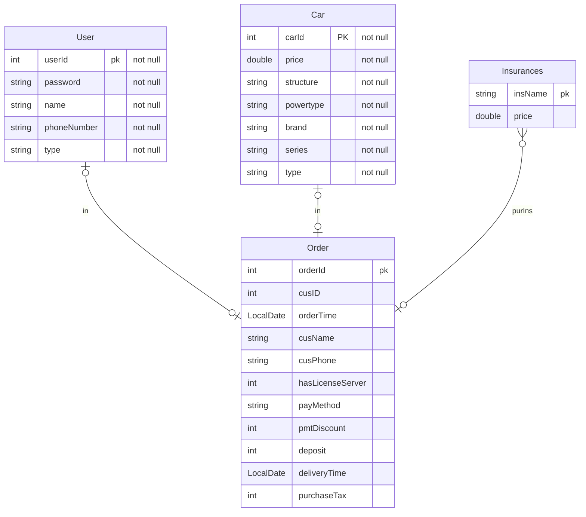

# **汽车销售管理**

### 要求

+ 车辆管理员：后台管理人员，主要是为了对车辆的属性进行管理

+ 销售人员流程管理：
  + 签订合同，需要记录合同信息：
    + 车辆信息：车辆的id
    + 用户信息：身份证，电话号码，家庭住址
    + 订单信息： 车辆的保险信息，是否上牌，订单时间，用户购买的费用结算的方式(全款和分期)，需要的总费用，已经付的费用，折扣，定金，交付时间，以旧换新，销售分成
    + 备注信息：备注
  + 购买：同意合同后，用户付款，交税，需要上牌就去给客户上牌，记录是否完成上述要求

**系统说明**

+ ]本系统并不面向购车者，面向销售车辆者
+ 系统主要是记录车辆管理者和销售人员
+ 交付时间有期限

**升级功能**

界面  JavaFX

导入 批量导入 Excel 中的数据

### 实体类

+ Car
+ Order
  + 开票信息属性
    + 订单ID`orderId`
    + `carId`
    + 销售人员id `userID`：
    + 订单时间 `orderTime`:
    + 购买者身份号码`cusId`:
    + 购买者姓名 `cusName`:
    + 购买者联系方式 `cusPhone`:
  + 付款项目
    + 车辆的保险信息`insurances`：保险有多种，该属性为类集合
    + 是否提供上牌照服务`hasLicenseServer`：收费服务，可以不办理
    + 用户购买的费用结算的方式(全款和分期) `payMethod`：全款和分期的提供的服务不同
    + 优惠活动减免金额 `pmtDiscount`：(店的折扣活动或则地方的购车补助),这个只涉及金额
    + 定金 `deposit  `:是抵押物的一种，确保购车合同的有效性
    + 交付时间 `deliveryTime `：交付车辆的信息
    + 购置税`purchaseTax`: 购置税由税务机关征收的购置税制设置范围内相关财物的行为和财产征收的税收
+ User
  + 员工id `userId`:
  + 员工姓名 `name`
  + 员工联系方式 `phoneNumber`
  + 员工类型（销售，车辆管理，最高级别的管理员）`type`
  + 密码 `password`
+ Insurance
  + 交强险`clivta`:	机动车交通事故责任强制保险
  + 三责险`tpl`:
  + 车损险`cdw`:
  + 划痕险`si`：
  + 新能源车险`neai`：

### 功能总结

+ 工作人员的登录注册
  + 车辆管理者的身份验证（没有权限进行注册
  + 销售的身份验证（没有权限注册
  + 最高级别的管理人员的身份验证（账号信息在员工入职时分配，这个账号负责对员工信息增删改查）
+ 交易过程记录
  + 能够查看各种车辆的信息（以便回答用户的问题）
  + 交易过程记录并生成订单
    + 对订单中的各项进行检查，查看每个字段是否合法
+ 车辆管理
  + 车辆的增删改查
  + 批量导入功能


### 数据库设计

需要的数据库有：User, Car ,Order,Insurance



### 系统结构

以Maven为项目结构

主要分为四个层次

+ impl
+ mapper
+ entity
+ service
+ ui
+ utils

### 一些简单规范

+ Dao 层的SQL异常要在本层处理

+ 实体类在使用过程中，如果创建过程中，不需要设置所有的字段，那建议是使用set方法

### MyBatis

+ 可以简化许多操作
+ 自动维护一个 线程池

一些在编写代码时发现的不方便的地方

+ 在调用Mybatis的接口时，还需要维护一个 SqlSession
```java
@Test
public class ImplTest {
  @Test
  public void testCarMapper() {
    TestImpl test;
    SqlSession sqlSession = SqlConnection.getSqlsession();
    test = sqlSession.getMapper(TestImpl.class);
    System.out.println(test.selectCarByCarId(1));
    sqlSession.close();
  }
}
```

这其中需要在每一步调用数据库的过程，都要执行一遍获得sqlSession,还要及时关闭，
这个操作重复多遍，应该需要将这个函数提取出来，这样才可以实现更好的服务

> 其实关于这个问题，是有解决方法的，可以让一个框架，来维护其中的接口 test ，自动化的在每次使用 函数时都创建 sqlSession 并及时close()
> 而现在比如 Spring 就解决了这个问题