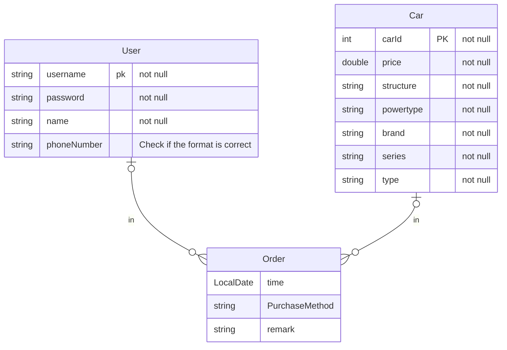

# **汽车销售管理**

### 要求

+ **能够实现4S店的车辆种类、价格等进行管理**
  + 管理员：后台管理人员，主要是为了对车辆的各个属性进行管理

+ **能够对客户进行管理，实现客户购买车辆的流程管理，费用结算等功能**
  + 用户：登录注册，购买车辆，费用结算等

### 功能总结

+ 用户的登录注册
  + 用户信息的增删改查功能
+ 用户购买车辆
  + 选购车辆
    + [【车型大全】汽车车型大全_汽车之家 (autohome.com.cn)](https://www.autohome.com.cn/car/) 具体的筛选可以按照这个网站
+ 费用结算
  + 交易过程记录并生成订单
+ 车辆管理
  + 车辆的增删改查


### 数据库设计

需要的数据库有：User, Car ,Order

使用 MySQL 作为本地数据库



### 类图

```mermaid

```


### 系统结构

以Maven为项目结构

主要分为四个层次

+ implements
+ DAO
  + 实现类
+ entity
  + 实体类
+ service
+ UI

### 一些简单规范
+ Dao 层的SQL异常要在本层处理

